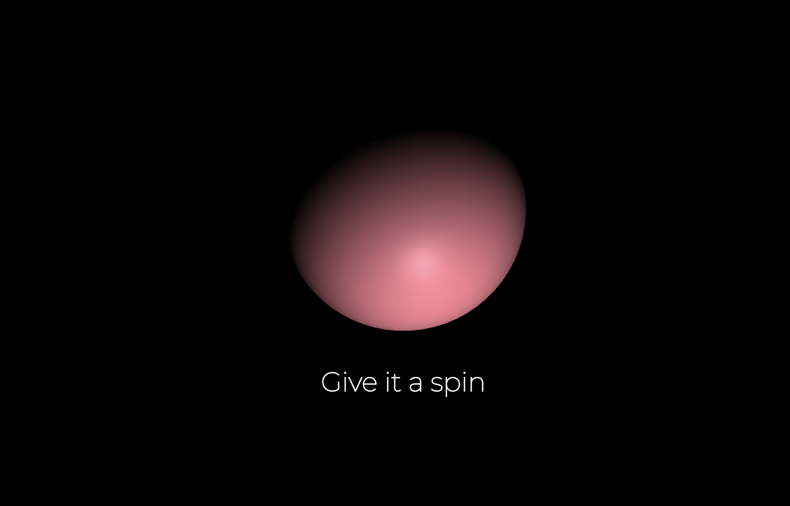

# Sphere

> ThreeJS geometry example



## Installation

```sh
git clone git@github.com:lucaford/sphere-threejs.git
yarn
yarn dev
```

## Usage

Change sphere colors using threejs controlls as you move your mouse up and down. Timeline animations with gsap.
